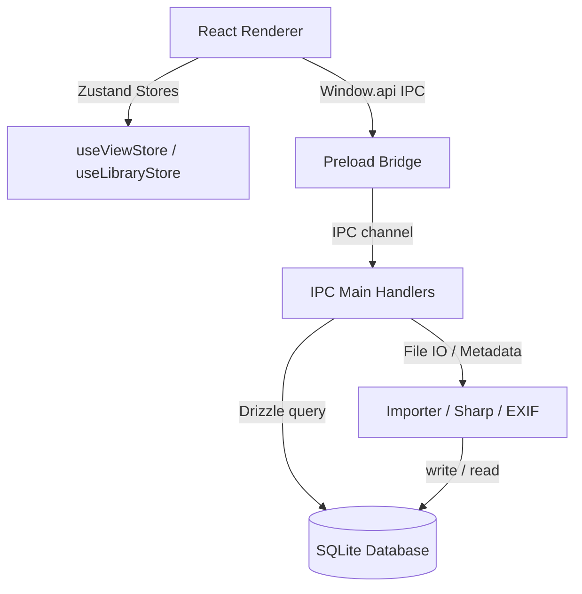

# VisFlow Architectural Specification & Codebase Structure

This document outlines the codebase directory structure, key subsystems, data flow, and component relationships in the VisFlow Electron application. It is designed to serve as an onboarding map for developers and a structural context reference for AI/vibecoding tools.

---

## 📂 Directory Layout Map

```text
visflow/
├── electron-builder.yml       # Electron builder packaging options
├── package.json               # Node dependencies and npm scripts
├── tsconfig.json              # Main TypeScript config
├── vite.config.ts             # Vite build configuration
├── README.md                  # User-facing summary & user guide
├── ARCHITECTURE.md            # This architectural specification document
├── src/
│   ├── main/                  # Main Process (Electron Node.js runtime)
│   │   ├── index.ts           # App bootstrap, IPC registration, and ready handlers
│   │   ├── protocol.ts        # Custom protocol registration (thumb://, local-image://)
│   │   ├── db/
│   │   │   ├── connection.ts  # Lazy better-sqlite3 database connection and DDL setup
│   │   │   └── schema.ts      # Drizzle ORM table definitions
│   │   ├── ipc/               # IPC Main Handlers (Receives UI operations)
│   │   │   ├── collections.ts # Manual virtual collections (Create, Update, Delete, Add Images)
│   │   │   ├── images.ts      # Image retrieval (getAll filters, Update rating/label, Delete)
│   │   │   ├── playlists.ts   # Slideshow playlists (Create, Reorder, Add/Remove Items)
│   │   │   ├── smart-groups.ts# Smart groups (Rules JSON parser and dynamic evaluator query)
│   │   │   └── tags.ts        # Label tagging (Create, Rename, Delete, Tag/Untag Images)
│   │   └── services/
│   │       ├── exif.ts        # EXIF parser using exif-parser
│   │       ├── importer.ts    # File walking, sharp dimension queries, and SQLite backfill script
│   │       └── thumbnail.ts   # Thumbnail generator creating 300px JPEGs in userData/thumbnails
│   │
│   ├── preload/               # Preload scripts (Isolated IPC boundary bridge)
│   │   └── index.ts           # Exposes main process APIs to window.api in renderer
│   │
│   └── renderer/              # Renderer Process (React Front-end)
│       ├── App.tsx            # Main App container, layout router, and keyboard event listener
│       ├── main.tsx           # React entry point
│       ├── index.html         # HTML mount point
│       ├── index.css          # Design system CSS variables, themes, resets, and utility classes
│       ├── types/
│       │   └── index.ts       # Shared TypeScript interfaces
│       ├── lib/
│       │   └── utils.ts       # Helper utilities (Group by date, recursive collection tree builder)
│       ├── hooks/
│       │   └── useDragDrop.ts # Drag and drop file import hook
│       ├── stores/            # Zustand global state stores
│       │   ├── useLibraryStore.ts # Cache for images, tags, playlists, smart groups, import progress
│       │   └── useViewStore.ts   # Active view state, layout styles, sorting, slider levels, themes
│       └── components/        # React UI component directory
│           ├── common/        # Shared basic UI elements
│           │   ├── Modal.tsx           # Glassmorphism modal wrapper
│           │   ├── ContextMenu.tsx     # Custom cursor-positioned right-click menu
│           │   └── CommandPalette.tsx  # Global search palette (Ctrl+K)
│           ├── layout/        # Layout shells
│           │   ├── Sidebar.tsx         # Collapsible sidebar, category menus, modal creation hooks
│           │   ├── Toolbar.tsx         # Controls header (Layout toggles, sliders, sorting selects)
│           │   └── StatusBar.tsx       # Bottom info bar and live file-import tracker
│           ├── organize/      # Organization and setting wizards
│           │   ├── CollectionTree.tsx  # Recursive tree nodes rendering collections list
│           │   ├── PlaylistEditor.tsx  # Modal panel configuring playlist speed & transitions
│           │   └── SmartGroupEditor.tsx# Modal wizard composing smart filter JSON rules
│           ├── viewer/        # Single photo detailed viewer
│           │   ├── ImageViewer.tsx     # Scroll zoom, double-click reset, keyboard arrow navigation
│           │   └── InfoPanel.tsx       # Photo metadata inspector (exif data, folder path, dimensions)
│           └── gallery/       # Gallery view mode layouts
│               ├── GalleryView.tsx     # View router dispatching child layouts based on orgMode
│               ├── ImageCard.tsx       # Polaroid-styled thumbnail card (aspect:1, rating overlay)
│               ├── GridLayout.tsx      # Standard cropped square auto-fill grid layout
│               ├── MasonryLayout.tsx   # Un-cropped Pinterest columns masonry
│               ├── TimelineLayout.tsx  # Photos grouped by date, supports Grid or Masonry styling
│               ├── FolderLayout.tsx    # Groups photos by physical disk paths (supports sorting, wrap/scroll)
│               └── CollectionsOverview.tsx # Groups photos by manual Collections (supports wrap/scroll)
```

---

## 🔄 Core Subsystems & Data Flow



### 1. Database Schema (`src/main/db/schema.ts`)
- **`images`**: Core photo record holding file paths, ratings, colors, EXIF metadata, and sharp-extracted dimensions.
- **`collections`**: Parent-child nodes representing virtual albums.
- **`image_collections`**: Join table matching image IDs to collection IDs with a manual `sortOrder` flag.
- **`tags`**: Tag strings mapped to colored dots.
- **`image_tags`**: Mapping join table.
- **`playlists`**: Playlist profiles (loop, shuffle, slide intervals).
- **`playlist_items`**: Custom order slides binding image IDs to playlists.
- **`smart_groups`**: Rule profiles holding search filter configurations in JSON formats.

### 2. IPC Message System (`src/preload/index.ts` & `src/main/ipc/*`)
All renderer queries bypass Electron boundaries using safe ipcRenderer invokes wrapped inside preloader context bridges. The handlers are segregated by their functional domains under `/main/ipc/` and invoke backend models directly, ensuring the UI remains highly decoupled from filesystem database details.

### 3. State Management Flow (`src/renderer/stores/`)
- **`useViewStore.ts`**: Coordinates transient interface variables (`sidebarOpen`, `theme`, `searchQuery`, `viewerOpen`, `gridSize`). It separates **Visual Styles** (`layoutStyle`: `'grid' | 'masonry'`) from **Group Sorting** (`orgMode`: `'all' | 'timeline' | 'folders' | 'collections'`) so they can toggle independently.
- **`useLibraryStore.ts`**: Caches structural library data loaded from backend processes (`images`, `collections`, `tags`, `playlists`, `smartGroups`) and broadcasts selection sets (`selectedImageIds`).

### 4. Custom Local Asset Protocols (`src/main/protocol.ts`)
To adhere to Chrome's strict Content Security Policy (CSP), absolute disk paths (e.g., `C:\path\img.jpg`) are not directly loadable as file-URLs in renderer processes. We register custom routing protocols:
- **`thumb://<imageId>`**: Serves cached thumbnails generated by the Sharp processing queue.
- **`local-image://_/?path=<encodedPath>`**: Reads and returns full-resolution images for viewer streams safely.

---

## 🎨 Layout Routing Strategy (`src/renderer/components/gallery/GalleryView.tsx`)

`GalleryView.tsx` serves as the router, switching layout renderers according to the global `orgMode` and `layoutStyle`:

| Active View (`currentView`) | Org Mode (`orgMode`) | Layout Style (`layoutStyle`) | Wrap Mode (`foldersWrap`) | Rendered Component |
| :--- | :--- | :--- | :--- | :--- |
| **All Photos** | `'all'` | `'grid'` | *N/A* | `GridLayout` |
| **All Photos** | `'all'` | `'masonry'` | *N/A* | `MasonryLayout` |
| **All Photos** | `'timeline'` | `'grid'` | *N/A* | `TimelineLayout` (Grid subgroups) |
| **All Photos** | `'timeline'` | `'masonry'` | *N/A* | `TimelineLayout` (Masonry subgroups) |
| **All Photos** | `'folders'` | `'grid'` / `'masonry'` | `false` (Scroll) | `FolderLayout` (Horizontal scrolling flex track) |
| **All Photos** | `'folders'` | `'grid'` / `'masonry'` | `true` (Wrap) | `FolderLayout` (Wrapped grid/masonry block) |
| **All Photos** | `'collections'` | `'grid'` / `'masonry'` | `false` / `true` | `CollectionsOverview` |
| **Specific Album/Tag/Group** | *N/A* | `'grid'` / `'masonry'` | *N/A* | `GridLayout` / `MasonryLayout` |

---

## ⚙️ Key Development Scripts & Build Pipelines

- **`npm run dev`**: Spawns Vite development servers and launches Electron CLI in double-reload watcher states.
- **`npm run typecheck`**: Runs static type audits across both Electron Node processes (`tsconfig.node.json`) and React Web codes (`tsconfig.web.json`).
- **`npm run build`**: Triggers full bundling using `electron-vite build`, outputs files to `out/` for packaging.
